# 3311 Notes

### General Info
https://webcms3.cse.unsw.edu.au/COMP3311/24T1/

Course Email: cs3311@cse.unsw.edu.au  
PostgreSQL online editor: https://onecompiler.com/postgresql

## Database Management Systems
A `Database Management System (DBMS)` is a software system that is designed to manage and organize data in a structured manner. 

## Types of DBMS
### Relational Database Management System (RDBMS):
`Data Model:` Organizes data into two-dimensional tables (rows and columns).
`Key Features:` Uses SQL (Structured Query Language) for querying and managing data.
Each table has a primary key that uniquely identifies records.
Example: PostgreSQL, MySQL

### Object-Oriented Database:
Combines relational database concepts with object-oriented principles.

Represents data as objects (used in object-oriented programming).
Example: MongoDB.

## Data Modelling

### Aim
- `Information` contained in the database
(entities: students, courses, accounts, branches, patients)
- `Relationships` between data items
(John is enrolled in COMP3311, Tom's account is held at Coogee)
- `Constraints` on data
(7-digit IDs, students can enrol in no more than 3 courses per term)

### Inputs and Outputs
`Inputs`: enterprise to be modelled, user requirements   
`Outputs`: (semi) formal description of the database structure

### Object vs Record
`Object-based data models`  
- treat database as a collection of entities of various kinds
- provide very flexible/natural data structuring facilities
- may also allow description of code for actions on objects

`Record-based data models`
- treat database as a collection of fixed-size records
- less flexible data structures than with object-based models
- closer to physical level so easier to implement efficiently

## Entity-Relationship (ER) Modelling
The world is viewed as a collection of inter-related entities.

ER has three major `modelling constructs`:
- `attribute`: data item describing a property of interest
- `entity`: collection of attributes describing object of interest
- `relationship`: association between entities (objects)

## ER Diagram
ER Diagrams are a graphical tool for data modelling.
- a collection of `entity set` definitions
- a collection of `relationship set` definitions
- `attributes` associated with entity and relationship sets
- `connections` between entity and relationship sets

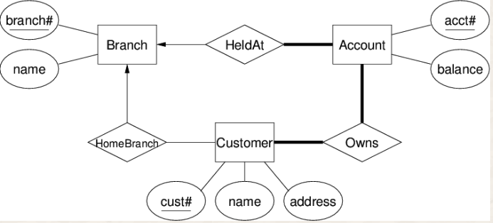
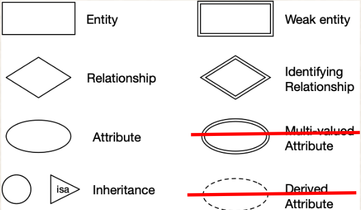

## Entity Sets
An `entity set` can be viewed as either:
- a set of entities with the same set of attributes (extensional)
- an abstract description of a class of entities (intensional)

`Primary Key:` set of attributes whose set of values are distinct over an entity set (superkey)
- natural (e.g., name+address+birthday) or artificial (e.g., SSN)

`Candidate key:` minimum set of attributes required to uniquely identify an entity (minimum superkey, no subset is a key)  

`Primary key` = candidate key chosen by designer

Indicated by underline in ER diagrams

## Relationship Sets
`Relationship:` an association among several entities
- Person (Entity) `is the owner of` Account (Entity)

`Relationship set:` collection of relationships of the same type  

### Degree
`Degree:` number of entities involved in relationship (in ER model, ≥ 2)  

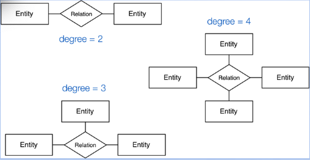

### Cardinality
`Cardinality:` number associated entities on each side of relationship  

`one-to-one	`	
- each a is associated with at most one b
- each b is associated with at most one a
  
`one-to-many`
- each a is associated with zero or more b
- each b is associated with at most one a
  
`many-to-one`	
- each a is associated with at most one b
- each b is associated with zero or more a
  
`many-to-many`
- each a is associated with zero or more b
- each b is associated with zero or more a

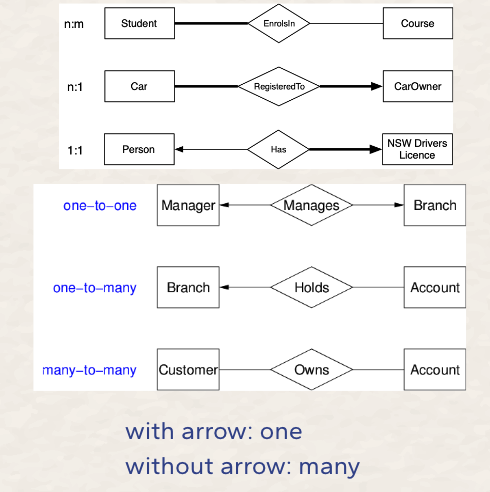

### Participation
`Participation:` describe the level of participation the entity is involved with for that specific relationship

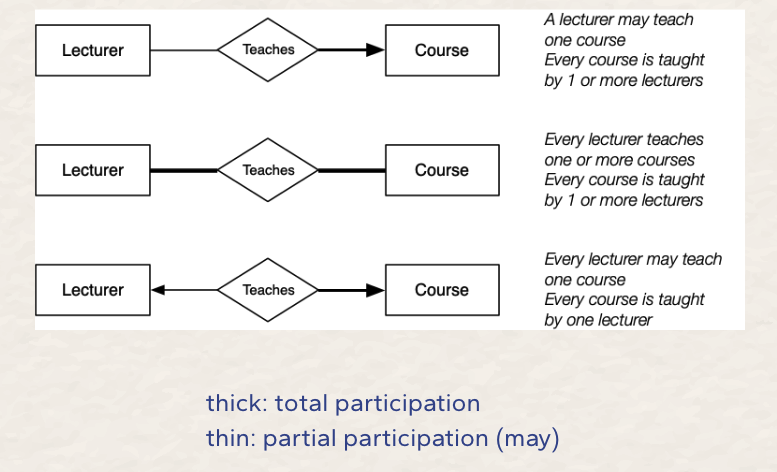

### Examples


- Every tutor is teaching 0 or more students (A tutor may teach 1 or more students)
- Every student is taught by 0 or 1 tutors (A student may be taught by a tutor)

<br>


- Every tutor is teaching 1 or more students 
- Every student is taught by 0 or 1 tutors (A student may be taught by a tutor)

<br>


- Every tutor is teaching 0 or more students (A tutor may teach 1 or more students)
- Every student is taught by 0 or more tutors (A student may be taught by 1 or more tutors)

<br>


- Every tutor is teaching 0 or more students (A tutor may teach 1 or more students)
- Every student is taught by 1 or more tutors (A student may be taught by a tutor)

## Weak Entity Set
`Weak entities` exist only because of association with other entities.

- family of employees in a company
(would not be interested in the family once the employee leaves)

Weak entities
- do not have a primary key (or any superkey)
- have a subset of attributes that form a `discriminator`
- need to be considered in conjunction with strong entities

ER diagrams:
- weak entities are denoted by `double-boxes`
- strong/weak entity relationships are denoted by `double-diamonds`
- discriminators are denoted by `dotted underline`

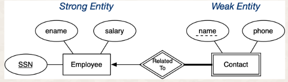

## Subclasses and Inheritance
A subclass of an entity set A is a set of entities:
- with all attributes of A, plus (usually) it own attributes
- that is involved in all of A's relationships, plus its own

If an entity set has multiple subclasses, they may be:
- `disjoint` - an entity belongs to at most one subclass
- `overlapping` - an entity may belong to several subclasses

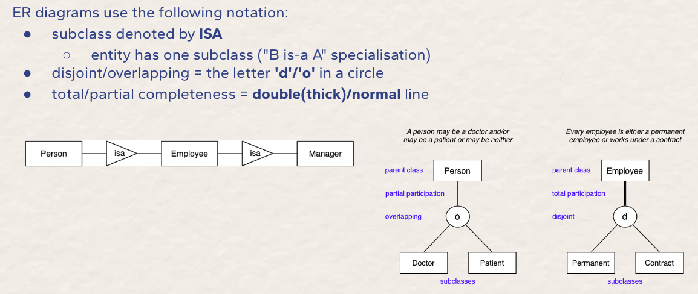

## Limitations of ER Models
There are some design aspects that ER does not deal with:

`attribute domains`
- e.g. should phone "number" be represented by number or string?

`computational dependencies`
- e.g. employee's salary is determined by department and level
  
`general constraints`
- e.g. manager's budget is less than 10% of the combined budget of all departments they manage

## Relational Model
The relational data model is a collection of inter-connected relations (or tables)

`Relations` contain:
- name (unique within a given database)
- set of attributes (column headings)

`Attributes` contain:
- name (unique within a given relation)
- associated domain (set of allowed values)

### Terminology
`Tuples` : list of values
- (1234567, John Smith, BE, SENG, 75.2)
- tuples: (2,3)  ≠  (3,2)
  
`Relation Instance` : set of tuples
-  { (1,2,3), (3,2,1), (1,3,5), (2,4,6) }
- relation: { (a,b), (c,d) }  =  { (c,d), (a,b) }

`Constraint`: logical statements on valid data
- zID is unique and 0 ≤ WAM ≤ 100

<br>

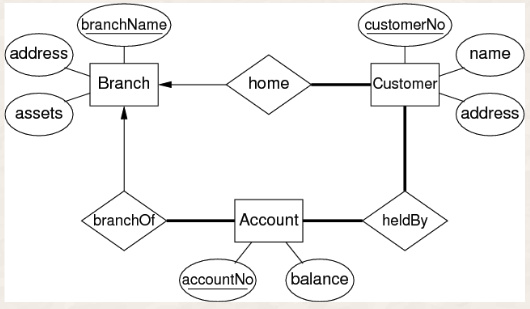
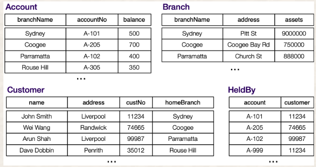

## Foreign Keys
A foreign key is a column or group of columns that identifies links between tables. 
- Foreign keys are often primary keys from different tables.

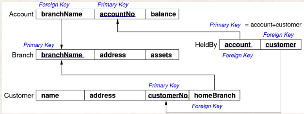

## ER-Relational Mapping
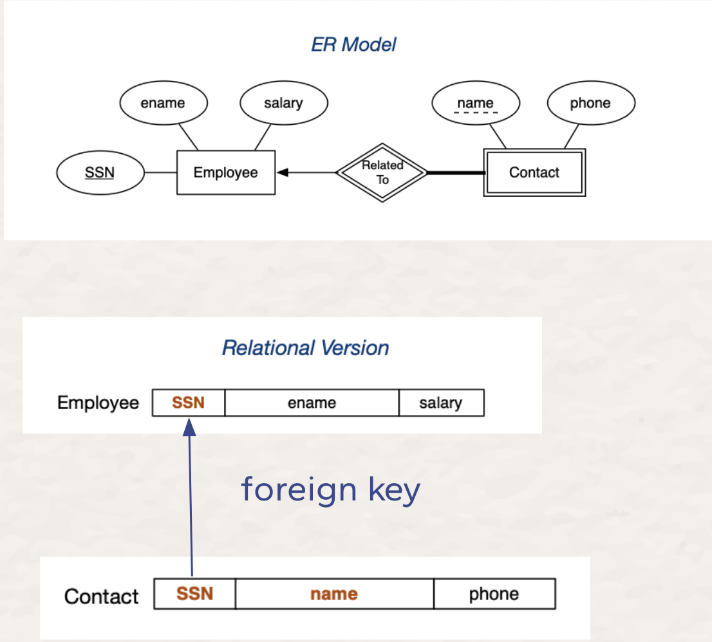

## SQL
`SQL` is a "programming" language for
- describing data (tables, rows, fields, types, constraints)
- manipulating data (query language)

<br>

- `" "` allow non-alpha chars in identifiers and make id's `case-sensitive`

- PostgreSQL maps non-quoted identifiers map to **lower case**
    -  BanK = BANK = bank
- extended string contains \escapes
    - `E'\n', E'O\'Brien'`
- typecast via `expr::type'
    - `'10'::integer`

### User defined types
```sql 
-- domains: constrained version of existing type
CREATE DOMAIN PosInt AS integer CHECK (value > 0);
```

```sql
-- tuple types: defined for each table
CREATE TYPE Name AS ( AttrName AttrType, ... )
```

```sql 
-- enumerated type: specify elements and ordering
CREATE TYPE Grade AS ENUM ('FL','PS','CR','DN','HD');
```

### Tuple and Set Literals
Tupes and sets constants are written as:
(val1, val2, val3)

```sql
-- tuple literal  
INSERT INTO Student(studeID, name, degree)
   VALUES (2177364, 'Jack Smith', 'BSc')
```

```sql 
-- set literal  
CONSTRAINT CHECK gender IN ('male','female','unspecified')
```

## Meta-data Language (within SQL)
A **relation schema** defines an individual table
 - table name, attribute names, attribute domains, keys, etc.

A **database schema** is a collection of relation schemas that
- defines the structure the whole database
- additional constraints on the whole database

```sql
-- format
CREATE TABLE TableName (
    attribute1   domain1   constraints1,
    attribute2   domain2   constraints2,
    ...
    table-level constraints, ...
)

-- example
CREATE TABLE Students (
    zid     serial,
    family  varchar(40),
    given   varchar(40) NOT NULL,
    d_o_b   date NOT NULL,
    gender  char(1) CONSTRAINT GenderCheck
            CHECK (gender in ('M','F','N' )),
    degree  integer,
    PRIMARY KEY (zid), -- defined as UNIQUE and NOT NULL
    FOREIGN KEY (degree) REFERENCES Degrees(did)
);
```
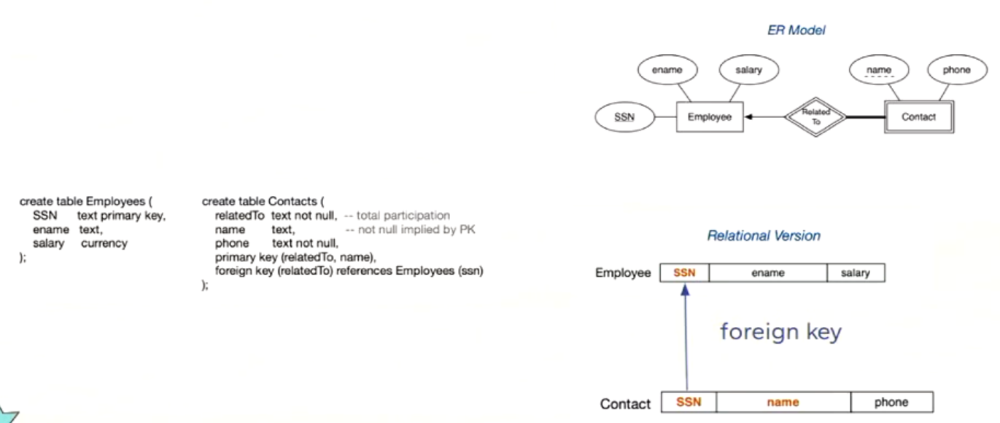

