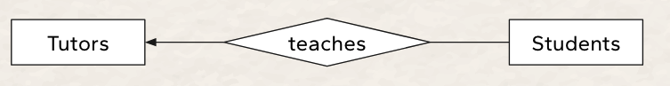
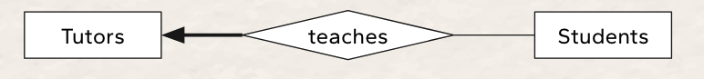
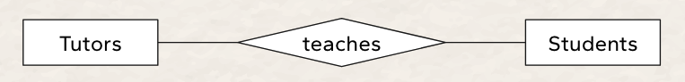
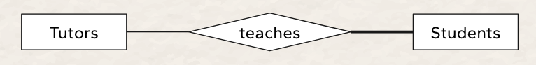
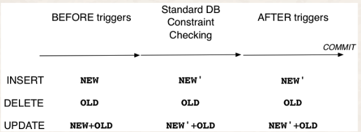
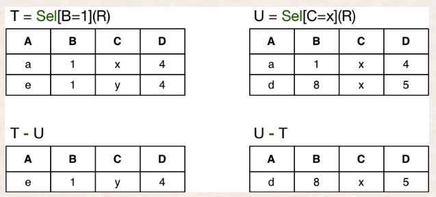
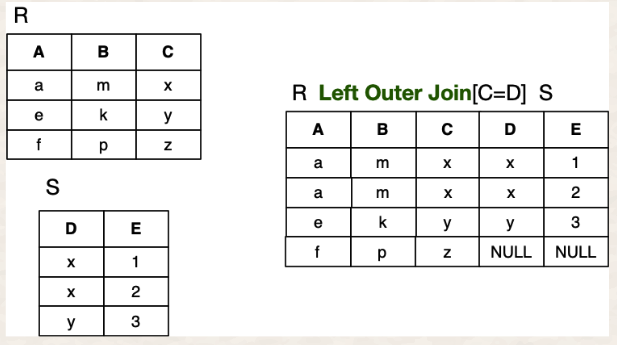
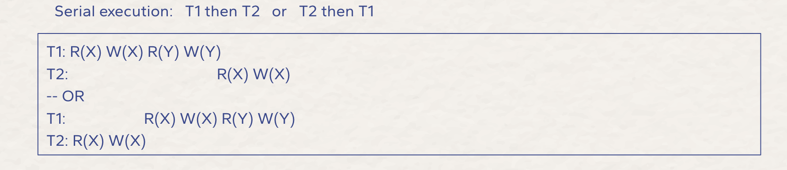

# 3311 Notes

### General Info
https://webcms3.cse.unsw.edu.au/COMP3311/24T1/

Course Email: cs3311@cse.unsw.edu.au  
PostgreSQL online editor: https://onecompiler.com/postgresql  
SQL Formatter: https://sqlformat.org/

## Database Management Systems
A `Database Management System (DBMS)` is a software system that is designed to manage and organize data in a structured manner. 

## Types of DBMS
### Relational Database Management System (RDBMS):
`Data Model:` Organizes data into two-dimensional tables (rows and columns).
`Key Features:` Uses SQL (Structured Query Language) for querying and managing data.
Each table has a primary key that uniquely identifies records.
Example: PostgreSQL, MySQL

### Object-Oriented Database:
Combines relational database concepts with object-oriented principles.

Represents data as objects (used in object-oriented programming).
Example: MongoDB.

## Data Modelling

### Aim
- `Information` contained in the database
(entities: students, courses, accounts, branches, patients)
- `Relationships` between data items
(John is enrolled in COMP3311, Tom's account is held at Coogee)
- `Constraints` on data
(7-digit IDs, students can enrol in no more than 3 courses per term)

### Inputs and Outputs
`Inputs`: enterprise to be modelled, user requirements   
`Outputs`: (semi) formal description of the database structure

### Object vs Record
`Object-based data models`  
- treat database as a collection of entities of various kinds
- provide very flexible/natural data structuring facilities
- may also allow description of code for actions on objects

`Record-based data models`
- treat database as a collection of fixed-size records
- less flexible data structures than with object-based models
- closer to physical level so easier to implement efficiently

## Entity-Relationship (ER) Modelling
The world is viewed as a collection of inter-related entities.

ER has three major `modelling constructs`:
- `attribute`: data item describing a property of interest
- `entity`: collection of attributes describing object of interest
- `relationship`: association between entities (objects)

## ER Diagram
ER Diagrams are a graphical tool for data modelling.
- a collection of `entity set` definitions
- a collection of `relationship set` definitions
- `attributes` associated with entity and relationship sets
- `connections` between entity and relationship sets


## Entity Sets
An `entity set` can be viewed as either:
- a set of entities with the same set of attributes (extensional)
- an abstract description of a class of entities (intensional)

`Key:` set of attributes whose set of values are distinct over an entity set
- if A is a key, then A can map to every other value in the relation 
- natural (e.g., name+address+birthday) or artificial (e.g., SSN)

`Candidate key:` minimum set of attributes required to uniquely identify an entity 
- if AD -> BCDEF and A -> BCDE, then A is a candidate key and AD is not
- minimum superkey, no subset is a key

`Primary key` = candidate key chosen by designer

Indicated by underline in ER diagrams

## Relationship Sets
`Relationship:` an association among several entities
- Person (Entity) `is the owner of` Account (Entity)

`Relationship set:` collection of relationships of the same type  

### Degree
`Degree:` number of entities involved in relationship (in ER model, ≥ 2)  


### Cardinality
`Cardinality:` number associated entities on each side of relationship  

`one-to-one	`	
- each a is associated with at most one b
- each b is associated with at most one a
  
`one-to-many`
- each a is associated with zero or more b
- each b is associated with at most one a
  
`many-to-one`	
- each a is associated with at most one b
- each b is associated with zero or more a
  
`many-to-many`
- each a is associated with zero or more b
- each b is associated with zero or more a


### Participation
`Participation:` describe the level of participation the entity is involved with for that specific relationship


### Examples


- Every tutor is teaching 0 or more students (A tutor may teach 1 or more students)
- Every student is taught by 0 or 1 tutors (A student may be taught by a tutor)

<br>



- Every tutor is teaching 1 or more students 
- Every student is taught by 0 or 1 tutors (A student may be taught by a tutor)

<br>



- Every tutor is teaching 0 or more students (A tutor may teach 1 or more students)
- Every student is taught by 0 or more tutors (A student may be taught by 1 or more tutors)

<br>



- Every tutor is teaching 0 or more students (A tutor may teach 1 or more students)
- Every student is taught by 1 or more tutors (A student may be taught by a tutor)

## Weak Entity Set
`Weak entities` exist only because of association with other entities.

- family of employees in a company
(would not be interested in the family once the employee leaves)

Weak entities
- do not have a primary key (or any superkey)
- have a subset of attributes that form a `discriminator`
- need to be considered in conjunction with strong entities

ER diagrams:
- weak entities are denoted by `double-boxes`
- strong/weak entity relationships are denoted by `double-diamonds`
- discriminators are denoted by `dotted underline`


## Subclasses and Inheritance
A subclass of an entity set A is a set of entities:
- with all attributes of A, plus (usually) it own attributes
- that is involved in all of A's relationships, plus its own

If an entity set has multiple subclasses, they may be:
- `disjoint` - an entity belongs to at most one subclass
- `overlapping` - an entity may belong to several subclasses


## Limitations of ER Models
There are some design aspects that ER does not deal with:

`attribute domains`
- e.g. should phone "number" be represented by number or string?

`computational dependencies`
- e.g. employee's salary is determined by department and level
  
`general constraints`
- e.g. manager's budget is less than 10% of the combined budget of all departments they manage

## Relational Model
The relational data model is a collection of inter-connected relations (or tables)

`Relations` contain:
- name (unique within a given database)
- set of attributes (column headings)

`Attributes` contain:
- name (unique within a given relation)
- associated domain (set of allowed values)

### Terminology
`Tuples` : list of values
- (1234567, John Smith, BE, SENG, 75.2)
- tuples: (2,3)  ≠  (3,2)
  
`Relation Instance` : set of tuples
-  { (1,2,3), (3,2,1), (1,3,5), (2,4,6) }
- relation: { (a,b), (c,d) }  =  { (c,d), (a,b) }

`Constraint`: logical statements on valid data
- zID is unique and 0 ≤ WAM ≤ 100

<br>


## Foreign Keys
A foreign key is a column or group of columns that identifies links between tables. 
- Foreign keys are often primary keys from different tables.


## ER-Relational Mapping


## SQL
`SQL` is a "programming" language for
- describing data (tables, rows, fields, types, constraints)
- manipulating data (query language)

<br>

- `" "` allow non-alpha chars in identifiers and make id's `case-sensitive`

- PostgreSQL maps non-quoted identifiers map to **lower case**
    -  BanK = BANK = bank
- extended string contains \escapes
    - `E'\n', E'O\'Brien'`
- typecast via `expr::type'
    - `'10'::integer`


```sql
-- testing for NULL
x IS NULL     

x IS NOT NULL
```

### User defined types
```sql 
-- domains: constrained version of existing type
CREATE DOMAIN PosInt AS integer CHECK (value > 0);
```

```sql
-- tuple types: defined for each table
CREATE TYPE Name AS ( AttrName AttrType, ... )
```

```sql 
-- enumerated type: specify elements and ordering
CREATE TYPE Grade AS ENUM ('FL','PS','CR','DN','HD');
```

### Tuple and Set Literals
Tupes and sets constants are written as:
(val1, val2, val3)

```sql
-- tuple literal  
INSERT INTO Student(studeID, name, degree)
   VALUES (2177364, 'Jack Smith', 'BSc')
```

```sql 
-- set literal  
CONSTRAINT CHECK gender IN ('male','female','unspecified')
```

## Meta-data Language (within SQL)
A **relation schema** defines an individual table
 - table name, attribute names, attribute domains, keys, etc.

A **database schema** is a collection of relation schemas that
- defines the structure the whole database
- additional constraints on the whole database

```sql
-- format
CREATE TABLE TableName (
    attribute1   domain1   constraints1,
    attribute2   domain2   constraints2,
    ...
    table-level constraints, ...
)

-- example
CREATE TABLE Students (
    zid     serial,
    family  varchar(40),
    given   varchar(40) NOT NULL DEFAULT 'Denton',
    d_o_b   date NOT NULL,
    gender  char(1) CONSTRAINT GenderCheck
            CHECK (gender in ('M','F','N' )),
    degree  integer,
    PRIMARY KEY (zid), -- defined as UNIQUE and NOT NULL
    FOREIGN KEY (degree) REFERENCES Degrees(did)
);
```


## Shell commands 
`createdb dbname` - create a new totally empty database  
`dropdb dbname` - remove all data associated with a database

Shell commands to dump/restore database contents:

`pg_dump dbname > dumpfile`  
`psql dbname -f dumpfile`  
(Database dbname is typically created just before restore)

## Managing Tables
```sql
CREATE TABLE tableName ( Attributes+Constraints )
```

```sql
ALTER TABLE  tableName  TableSchemaChanges
```

```sql
DROP TABLE  tableName(s)  [ CASCADE ]
--CASCADE option drops objects which depend on the table. objects tuples or views NOT whole table
```

```sql
TRUNCATE TABLE  tableName(s)  [ CASCADE ]
--CASCADE option truncates tables which refer to the table

```

## Managing Tuples
```sql
INSERT INTO RelationName VALUES (val1, val2, val3)

INSERT INTO RelationName (Attr1, Attr2, ...) 
VALUES (valForAttr1, valForAttr2, ...)

INSERT INTO RelationName VALUES Tuple1, Tuple2, Tuple3
```

```sql
DELETE FROM tableName WHERE condition
DELETE FROM S WHERE (SELECT count(*) FROM S) > 1;
```

```sql
UPDATE tableName 
SET AttrValueChanges 
WHERE condition

update  employee
set     salary = salary * 0.8
where   age < 25
```

## Queries
A query is a declarative program that retrieves data from a database.
```sql
SELECT   attribute(s)
FROM     tablename
[WHERE]    condition
[JOIN]      secondtable ON (PK=FK)
[GROUP BY] groupingAttributes
[HAVING]   groupCondition

-- Filtering
SELECT b,c FROM R(a,b,c,d) WHERE a > 5

-- Combining
SELECT x,y FROM R(x,y,z) JOIN S(a,b,c) ON R.y = S.a

-- Summarising
SELECT avg(mark) FROM …

-- Set operations
SELECT b,c FROM R(a,b,c,d) WHERE a > 5 
UNION SELECT b,c FROM R(a,b,c,d) WHERE d < 4

-- Grouping
... GROUP BY tableAttribute

-- Group Filtering
... GROUP BY tableAttribute HAVING max(tableAttribute) < 75

--Renaming
SELECT a as name
FROM Employee(a,b,c) e WHERE e.b > 50000
```

## Views
A view is like a "virtual relation" `defined via a query`. Views are like pointers to the base table.
- a view is valid only when the query is valid
- dropping a view does not affect `base table`

```sql
CREATE VIEW ViewName AS Query

--

CREATE VIEW ViewName (AttributeNames) AS Query

-- example
CREATE OR REPLACE VIEW helper (name, age) as (
    SELECT  eName, eAge 
    FROM    Employees
    WHERE   age > 25 -- loop through and checks each row
);

-- 
DROP VIEW ViewName
```

## Multi-Table Queries
```sql
-- INNER JOIN or JOIN: is intersection
-- LEFT JOIN: is entire table 1
-- RIGHT JOIN: is entire table 2
-- FULL JOIN: is union
-- WHERE clause typically filters out some of the joined tuples.

SELECT Attributes
FROM   R1
JOIN R2 ON (JoinCondition1)
JOIN R3 ON (JoinCondition2)
    ...
[WHERE]  Condition 
```


## Further SQL Queries

### Sets
Set literals are written as `(expr1, expr2, ...)`  (each expr yields an atomic value)

### Bags
SQL query results are actually bags (multisets), allowing duplicates

```sql
select age from Students;
-- yields (18,18,18,...19,19,19,19,...20,20,20,...)

-- Covert a bag to a set using DISTINCT
select distinct age from Students;
```

## `UNION,  INTERSECT,  EXCEPT`
```sql
R1 UNION R2		    -- set of tuples in either R1 or R2
R1 INTERSECT R2		-- set of tuples in both R1 and R2
R1 EXCEPT R2		-- set of tuples in R1 but not R2
```

- yield sets by default (eliminate duplicates)
- can produce bags with keyword `ALL`

```sql
(1,2,3) UNION (2,3,4)  yields  (1,2,3,4)
(1,2,3) UNION ALL (2,3,4)  yields  (1,2,3,2,3,4)
```

## Operators
`IN` operator tests whether a specified tuple/value is contained in a relation/bag.

```sql
SELECT * FROM table
WHERE attribute IN (SELECT x FROM S WHERE Cond)
```

`EXIST` (relation)  is true if relation is non-empty
```sql
SELECT * FROM R
WHERE  NOT EXISTS
    (SELECT * FROM R1 WHERE R1.a = R.b);
```

`ANY` and `ALL` behave as existential and universal quantifiers respectively.

- `ALL` returns TRUE if all of the subqueries values meet the condition. 
- `ALL` must be right after a comparison operator `(=, <, >)`,  returns true if all of the subqueries values meet the condition.

- `ANY` compares a value to each value in a list or results from a query and evaluates to true if the result of an inner query contains **at least one row**

```sql
SELECT name
FROM   Employees
WHERE  salary >= ALL(SELECT salary FROM Employees);
```

## Grouping
`SELECT-FROM-WHERE` can be followed by `GROUP BY`
- partition result relation into groups   (according to values of specified attribute)

Every attribute in the `SELECT` list must: 
- have an aggregation operator (`SUM, COUNT`) applied to it   
  OR 
- appear in the `GROUP-BY` clause


Groups can be filtered with the `HAVING` keyword.

- generate the groups as for `GROUP-BY`
- discard groups not satisfying `HAVING` condition

## Partitions
- Partition a table into groups
- Compute results that apply to each group
- Use these results with individual tuples in the group

```sql
SELECT attr1, attr2, ...,
       aggregate1 OVER (PARTITION BY attri),
       aggregate2 OVER (PARTITION BY attrj), ...
FROM   Table
WHERE  condition on attributes
```

## Difference between `GROUP BY` and `PARTITION`
- `GROUP-BY` produces one tuple for each group
- `PARTITION` augments each tuple with group-based value(s)


## Abstraction
https://docs.google.com/presentation/d/119uSL4VdPBdA_Ocp1pgmsUZm-jqfMTv8lNQF6FgVKv0/edit#slide=id.g2befcd2ae8c_0_180 - slide 27 

### Abstraction with `VIEWS`
```sql
CREATE VIEW
   CourseMarksWithAvg(course,student,mark,avg)
AS
SELECT course, student, mark,
       avg(mark) OVER (PARTITION BY course)
FROM   Enrolments;

SELECT course, student, mark
FROM   CourseMarksWithAvg
WHERE  mark < avg;
```

### Abstraction with `FROM`
```sql
SELECT course, student, mark
FROM   (SELECT course, student, mark,
               avg(mark) OVER (PARTITION BY course)
        FROM   Enrolments) AS CourseMarksWithAvg
WHERE  mark < avg;
```
- **must** provide name/alias for each subquery, even if never used
- subquery table inherits attribute names from query
  
### Abstraction with `WITH`
```sql
WITH CourseMarksWithAvg AS
     (SELECT course, student, mark,
             avg(mark) OVER (PARTITION BY course)
      FROM   Enrolments)
SELECT course, student, mark, avg
FROM   CourseMarksWithAvg
WHERE  mark < avg;

```
- **must** provide name/alias for each subquery, even if never used
- subquery table inherits attribute names from query

### Recursive Queries
WITH also provides the basis for recursive queries.

```sql
WITH RECURSIVE R(attributes) AS (
     SELECT ... not involving R
   UNION
     SELECT ... FROM R, ...
)
----------------------------------------------

INSERT INTO Parts (part, sub_part, quantity) VALUES
('Computer', 'Motherboard', 1),
('Computer', 'RAM', 2),
('Computer', 'HDD', 1),
('Motherboard', 'CPU', 1),
('Motherboard', 'GPU', 1),
('RAM', 'RAM Chip', 8),
('HDD', 'Platter', 3),
('CPU', 'Transistor', 1000000);

WITH RECURSIVE Included(sub_part, part, quantity) AS (
    -- initial query sets up initial state (base case)
    SELECT sub_part, part, quantity 
    FROM Parts
    WHERE part='Computer'
UNION ALL
    -- second query to update the state (recursive case)
    SELECT p.sub_part, p.part, p.quantity
    FROM   Included i JOIN Parts p
    ON     i.sub_part = p.part
)
SELECT sub_part, quantity FROM Included;
```

## Function
```sql
CREATE OR REPLACE FUNCTION
   funcName(argName argType)
   RETURNS val
AS $$
   SQL statements
$$ LANGUAGE sql;
```

- Function arguments are accessed as $1, $2, … (if argname is not specified)
- Return type as `SETOF` sometype, or equivalently by declaring it as `RETURNS TABLE(columns)`
<br>

- A stored function is invoked by `SELECT`


## Procedures
Procedures do not return anything, so no need to specify return type at start. 
<br>

- A stored function is invoked by `CALL`

```sql
CREATE PROCEDURE tp1 (accountno integer, debit numeric, OUT new_balance numeric) AS $$
    UPDATE bank
        SET balance = balance - debit  
        WHERE accountno = tp1.accountno
    RETURNING balance;
$$ LANGUAGE SQL;
```

## PLpgSQL
PLpqSQL is procedural language extension to PostgreSQL
- combination of sql and and procedural programming

## PLpgSQL functions
```sql
CREATE FUNCTION
   funcName(argname argType)
   RETURNS val
AS $$
DECLARE
   variable declarations
BEGIN
   code for function
END;
$$ LANGUAGE plpgsql;
```

## Data Types
- standard SQL data types - `CHAR, DATE, NUMBER, ...`
- user-defined PostgreSQL data types - `Point` 
- a special structured record type - `RECORD`
- table-row types - `Branches` or `Branches%ROWTYPE`
- types of existing variables - `Branches.location%TYPE` 
- There is also a `CURSOR` type for interacting with SQL.

### Record
- A record variable is similar to a row-type variable, it can hold only one row of a result set but it does not have a pre-defined structure
- Structure is determined when a select or for statement assigns a row to it

```sql
-- declare 
variable_name  record;

-- access
record_variable.field_name;
```

## Control strucutres


## `SELECT ... INTO ...`
```sql
SELECT select_list
INTO   variable_name
FROM   table_expression
WHERE  condition
```

`select a into b from R where ...`
- If the selection returns no tuples
    - the variable b gets the value `NULL`
- If the selection returns multiple tuples
    - the variable b gets the value from the **first tuple**

<br>

`FOUND` variable
- local to each function, set `FALSE` at start of function
- set true if a `SELECT` finds at least one tuple
- set true if `INSERT/DELETE/UPDATE` affects at least one tuple
- otherwise, remains as `FALSE`

## Returning multiple values
PLpgSQL functions can return a set of values `setof Type`

```sql
create type Point as (x float, y float);
```

## `INSET ... RETURNING ...`

```sql
insert into Table(...) values
(Val1, Val2, ... Valn)
returning ProjectionList into VarList
```
- captures values from tuples inserted into DB, saving one query statement

## Exceptions
When an exception occurs:

- control is transferred to the **relevant exception handling code**
- all database changes so far in this transaction are **undone**
- all function variables retain their **current values**

```sql
begin
    Statements
exception
    when Exceptions1 then
        StatementsForHandler1
    when Exceptions2 then
        StatementsForHandler2
    when others then
    -- use others for user-defined exceptions

-- example 
CREATE OR REPLACE FUNCTION 
    UpdateProductPrice(p_ProductID INT, p_NewPrice 
    DECIMAL(10,2)) RETURNS VOID 
AS $$
BEGIN
    UPDATE Products 
    SET Price = p_NewPrice 
    WHERE ProductID = p_ProductID;
    
    IF NOT FOUND THEN
        RAISE EXCEPTION 'Product with ID % does not 
                         exist.', p_ProductID;
    END IF;
    
EXCEPTION
    WHEN OTHERS THEN
        -- SQLERRM = RAISE EXCEPTION 
        RAISE NOTICE 'An error occurred: %', SQLERRM;
END;
$$ LANGUAGE plpgsql;
```
The `raise` operator can generate server log entries.
```sql
raise debug1 'Simple message';
raise notice 'User = %', user_id;
raise exception 'Fatal: value was %',value;
```

## Query results in PLpgSQL
```sql
declare
   tup Type;
begin
   for tup in Query
   loop
      Statements;
   end loop;
end;
```

```sql
create or replace function
   count_well_paid(minSalary integer) returns integer
as $$
declare
   nemps integer := 0;
   tuple record;
begin
    -- select count(*) from Employees where salary > 
    -- minSalary INTO nemps;

   for tuple in
       select salary from Employees 
   loop
        if (tuple.salary > _minsal) then
            nemps := nemps + 1;
        end if;
   end loop;
   return nemps;
end;
$$ language plpgsql;
```

- Type of `tup` variable must match type of Query results
- If declared as `record`, will auto match Query results type

## `Execute`
`EXECUTE` takes a string and executes it as an SQL query.

```sql
-- constant string
execute 'select * from Employees';


-- concatenation of constant strings
execute 'select * from ' || 'Employees';


-- using a name of e.g. table or attribute
execute 'select * from ' || quote_ident($1);


-- using a value generated in the program
execute 'delete from Accounts' || ' where holder=' || quote_literal($1);
```

```sql
CREATE OR REPLACE FUNCTION count_something(attr TEXT, _minval INTEGER) RETURNS INTEGER 
AS $$
DECLARE
   nemps INTEGER;
BEGIN
   -- Construct and execute a dynamic SQL statement
   EXECUTE 'SELECT COUNT(*) FROM Employees WHERE ' || attr || ' > ' ||  _minval::TEXT
   INTO nemps;
   
   RETURN nemps;
END;
$$ LANGUAGE plpgsql;
```

## Aggregates (more)
- `count(Tuples)`
- `sum(Numbers)`
- `max(AnyOrderedType)`

- Commonly used with `GROUP BY`

Action/semantic of aggregate function:
```sql
State = initial state
for each item T {
    # update State to include T
    State = updateState(State, T)
}
return makeFinal(State)
```

### User-defined Aggregates

```sql
-- baseType is type of input, eg: numeric

-- stype is the type of the state you hold, eg: numeric

-- [initicond] is initial state value, default NULL

-- sfunc is the plpgsql func that is applied to every iteration of state

-- [finalfunc] default final state: ffunc(state) -> result

-- [sortop] sorting operator (for min/max-type aggregates)s 

CREATE AGGREGATE aggName(baseType) (
    stype     = StateType,
    initcond  = InitialValue,
    sfunc     = StateFunction,
    finalfunc = FinalFunction,
    sortop    = OrderingOperator
);
```
  
```sql
-- don't need to declare state and base type like this, see example below.
create type BaseType as numeric;
create type StateType as (sum numeric, count numeric);
create type ResultType as numeric;

-- sfunction
create function meanFunc(s StateType, v BaseType) returns BaseType as $$
begin 
    if (v not null) then
        s.sum := s.sum + v
        s.count := s.count + 1
    end if;

    return s;
end;
$$
language plpgsql

-- finalfunc
create function compute(s StateType) returns ResultType 
as $$
begin   
    if (s.count = 0) then 
        return null;
    end if;

    return s.sum / s.count;
end;
$$ 
language plpgsql

create aggregate mean(BaseType) {
    stype = StateType
    initcondition = 0
    sfunction = meanFunc
    finalfunc = compute
}
```
```sql
CREATE OR REPLACE FUNCTION join(s1 TEXT, s2 TEXT) 
RETURNS TEXT 
AS $$
BEGIN
    if (s1 = '' OR s1 is NULL) then
      RETURN s2;
    elsif (s2 = '' OR s2 is NULL) then
      RETURN s1;
    else 
      RETURN s1 || ', ' || s2;
    end if;
END;
$$ LANGUAGE plpgsql;

CREATE AGGREGATE concat(TEXT) (
   STYPE    = TEXT,
   INITCOND = '',
   SFUNC    = join
);
```

## Assertions
Assertions are schema-level constraints

- involve multiple tables
- condition must hold at all times
- need to check again assertion for each change
- if check fails, reject the change

```sql
CREATE ASSERTION name CHECK (condition)
```

```sql
create assertion ClassSizeConstraint check (
   not exists (
      select c.id
      from   Courses c
             join Enrolments e on (c.id = e.course)
      group  by c.id
      having count(e.student) > 9999
   )
);
```

- A database with many assertions would be way too slow.
- So, most RDBMSs do not  implement general assertions.

Postgresql **does not** support `CREATE ASSERTION`

## Triggers
https://docs.google.com/presentation/d/1Z1NzUIj_AX54QgiwiQWamE7CRrfSgyiPRE0OU7vmMZY/edit#slide=id.g2bc62e78bf8_0_544

Triggers are `procedures` stored in the database, activated in response to database events. Eg. maintaining summary data

### ECA
Triggers provide event-condition-action (ECA) programming:
- an **event** activates the trigger
- trigger checks a **condition**, if the condition holds a procedure is executed(**action**)

```sql
-- SQL NOT Postgresql

CREATE TRIGGER TriggerName
{AFTER|BEFORE}  Event1
[ FOR EACH ROW ]
ON TableName
[ WHEN ( Condition ) ]
Block of Procedural/SQL Code ;
```

`FOR EACH ROW` clause:
- if present, code is executed on each modified tuple
-  if not present, code is executed once after all tuples are modified, just before changes are finally committed




## Triggers in PostgreSQL
PostgreSQL triggers provide a mechanism for `INSERT, DELETE, UPDATE` events, to activate PLpgSQL functions.
- `TP_OG` in the trigger func is either `INSERT`, `UPDATE`, `DELETE`

```sql
-- PostgreSQL
CREATE TRIGGER TriggerName
{AFTER|BEFORE|INSTEAD OF}  Event1 [OR Event2 ...]
ON TableName
[ WHEN ( Condition ) ]
FOR EACH {ROW|STATEMENT}
EXECUTE PROCEDURE FunctionName(args...);
```

**EXAMPLES OF TRIGGERS IN USE**
```sql
CREATE OR REPLACE FUNCTION instead_of_insert_on_view()
RETURNS TRIGGER AS $$
BEGIN
    INSERT INTO products(product_name, price)
    VALUES (NEW.product_name, 1000);
    RETURN NEW;
END;
$$ LANGUAGE plpgsql;

CREATE TRIGGER trigger_instead_of_insert
BEFORE INSERT ON products_view
FOR EACH ROW
EXECUTE FUNCTION instead_of_insert_on_view();

-- trigger called here
INSERT INTO products_view (product_name) VALUES
('Mouse');
```

## Python
### Data Types
- booleans: `True, False`
- numbers:  `42, 3.14, -5`
- strings: `"a string", "string2", 'it\'s fun'`
- lists: `[1,4,9,16,25], ['a','b','c']`
- tuples: `(3,5), (1,'a',3.0)`
- dictionaries: `{'a': 5, 'b': 98, 'c': 99}`

### Imports
```py
# imports an entire module or package
import math

# import specific from a module or package
from math import sqrt
```

### Command line arguments
`sys.argv`

```py
# python3 foo.py hello my name is Denton

import sys

sys.argv[0] # foo.py
sys.argv[1] # hello
sys.argv[2] # my
sys.argv[3] # name
sys.argv[4] # is
sys.argv[5] # Denton

```

## Psycopg2
Python module that provides
- a method to connect to PostgreSQL databases
- a collection of DB-related exceptions
- a collection of type and object constructors

```py
import psycopg2
```


### Connection
always declare `conn = None` before running `try` `catch` `finally`

```py
conn = psycopg2.connect(DB_connection_string)
conn = psycopg2.connect("dbname=mydb")
```
- creates a **connection** object on a named database
- returns a **connection** object used to access DB
- raises an `exception`, if can't connect

<br>

- `dbname` - name of database
- `user` - user name (for authentication)
- `password` - user password (for authentication)
- `host` - where is the server running (default=localhost)
- `port` - which port is server listening on (default=5432)


```py
cur = conn.cursor()
```
- set up a **handle** for performing queries/updates on database
- must create a **cursor** before performing any DB operations

```py
conn.close()
```
- close the database connection conn

```py
conn.commit()
```
- commit changes made to database since last **commit()**

### Cursors
`cur.execute(SQL_Statement, Values)`

- if supplied, insert values into the SQL statement, then execute the SQL statement
- **results are available via the cursor's fetch methods**

```py
# run a fixed query
cur.execute("select * from R where x = 1")

# run a query with values inserted
cur.execute("select * from R where x = %s", (1,))
cur.execute("select * from R where x = %s", [1])

# run a query stored in a variable
query = "select * from Students where name ilike %s"
pattern = "%mith%"
cur.execute(query, [pattern])
```

`cur.mogrify(SQL_statement, Values)`

- return the SQL statement as a string, with values inserted
- useful for checking whether execute() is doing what you want

```py
query = "select * from R where x = %s"
print(cur.mogrify(query, [1]))
# Produces: b'select * from R where x = 1'

query = "select * from R where x = %s and y = %s"
print(cur.mogrify(query, [1, 5]))
# Produces: b'select * from R where x = 1 and y = 5'

query = "select * from Students where name ilike %s"
pattern = "%mith%"
print(cur.mogrify(query, [pattern]))
# Produces: b"select * from Students where name ilike '%mith%'"
```

`list = cur.fetchall()`
- gets all answers for a query and stores in a list of tuples
- can iterate through list of results using Python's for

```py
# table R contains (1,2), (2,1)

cur.execute("select * from R")
for tup in cur.fetchall():
   x,y = tup
   print(x,y)   # or print(tup[0],tup[1])

# prints
1 2
2 1
```

`tup = cur.fetchone()`
- gets next result for a query and stores in a tuple
- can iterate through list of results using Python's `while`
```py
# table R contains (1,2), (2,1)

cur.execute("select * from R")
while True:
   t = cur.fetchone()
   if t == None:
      break
   x,y = tup
   print(x,y)

# prints
1 2
2 1
```

`tup = cur.fetchmany(nTuples)`
- gets next **nTuples** results for a query and stores tuples in a list
- when no results left, returns empty list

```py
# table R contains (1,2), (2,1)

cur.execute("select * from R")
while True:
   tups = cur.fetchmany(2)
   if tups == []:
      break
   for tup in tups:
      x,y = tup
      print(x,y)

# prints
1 2
2 1
```

## Calling plpgsql functions using Python
`cursor.execute()`
```py
cursor.execute(“select * from yourfunction(5)”)
```

`cursor.callproc(functionname, values)`
- parameters supplied as a list of values/vars

```py
cursor.callproc(“yourfunction”, [5])
```

## Relation Design and Redundancy
A **good** relational database design:
- must capture **all**  necessary attributes/associations
- do this with **minimal**  amount of stored information -> no redundant data

### Redundancy - anomalies 
Insert anomaly:
- when we insert a new record, we need to check that branch data is consistent with existing tuples
  
Update anomaly:
- if a branch changes address, we need to update all tuples referring to that branch

Deletion anomaly:
- if we remove information about the last account at a branch, all of the branch information disappears


## Functional Dependencies
https://docs.google.com/presentation/d/1XzIGyapNlWfx9dd_7ctN1XEHJOGfrDCRKurS0aXvx8E/edit#slide=id.g2bc62e78bf8_0_544

A relation instance r(R) satisfies a dependency X → Y  
  - if for any t, u ∈ r,   t[X] = u[X]   ⇒   t[Y] = u[Y]
  - if two tuples in R agree in their values for the set of attributes X, then they must also agree in their values for the set of attributes Y.


X → Y can also be read as "Y is functionally dependent on X" or "X determines Y".
-  → denotes functional dependency


### Notation

- **Attributes**		
  - upper-case letters from start of alphabet `(e.g. A, B, C, ...)`


- **Sets of attributes**		
  - concatenation of attribute names `(e.g. X=ABCD, Y=EFG )`


- **Relation schemas**		
  - upper-case letters, denoting set of all attributes `(e.g. R)`


- **Relation instances**		
  - lower-case letter corresponding to schema `(e.g. r(R))`


- **Tuples**		
  - lower-case letters   `(e.g. t, t', t1, u, v )`


- **Attributes in tuples**		
  - tuple[attrSet] `(e.g. t[ABCD], t[X])`

## Inference rules
- F1. Reflexivity   
  - X → X
- F2. Augmentation 
  - X → Y  ⇒  XZ → YZ
- F3. Transitivity   
  - X → Y, Y → Z  ⇒  X → Z
- F4. Additivity    
  - X → Y, X → Z   ⇒   X → YZ
- F5. Projectivity      
  - X → YZ   ⇒   X → Y, X → Z
- F6. Pseudotransitivity    
  - X → Y, YZ → W   ⇒   XZ → W

## Closures
https://docs.google.com/presentation/d/1_M6_sN1g8AkqQTCC4DUsdW4aANVfMx4Q-3kosjggO1A/edit#slide=id.g2c6126223c8_0_19

Given a set F of functional dependencies. 

The largest collection of dependencies that can be derived from F is called the **closure** of F and is denoted **F+**.


## Closures on Attributes 
Algorithms based on F+ rapidly become infeasible.
- use closures based on sets of attributes rather than sets of fds.

**Example**

Given a set X of attributes and a set F of fds, the closure of X (denoted X+) is
- the largest set of attributes that can be derived from X using F
- X+ = XYZ from {X→Y, Y→Z}  


## Closures to Determine Keys
What are the keys of R implied by F?
- find subsets K ⊂ R such that K+ = R


## Closures - Minimal Covers
Minimal cover **Fc** for a set F of fds:
- Fc (Minimal cover) is equivalent to F (fd set)
- all fds have the form X → Y (X variable attributes, Y is a single attribute, canonical form)
- it is not possible to make Fc smaller
  - either by deleting an fd
  - or by deleting an attribute from an fd


### Algorithm for computing Minimal Covers

Inputs: set **F** of fds
Output: minimal cover **Fc** of **F** 

- Step 1: put f ∈ Fc into canonical form
- Step 2: eliminate redundant attributes from f ∈ Fc
- Step 3: eliminate redundant fds from Fc
  


## Normal Forms
**Normalisation**: branch of relational theory providing design insights.
- characterise the level of redundancy in a relational schema
- provide mechanisms for transforming schemas to remove redundancy 

Normalisation algorithms reduce the amount of redundancy in a schema
- by decomposition   (break schema into connected pieces)

### Normal Forms Types
**NF**		
- all attributes have atomic values
- we assume this as part of relational model,
- so every relation schema is in 1NF
  
**2NF**		
- all non-key attributes fully depend on key (i.e. no partial dependencies) avoids much redundancy
  
`3NF` and `BCNF`	
- **no attributes depends on non-key attrs**

### Boyce-Codd Normal Form (BCNF):

- eliminates all redundancy due to functional dependencies
- but may not preserve original functional dependencies

**Conditions for BCNF**

For **all fds** X → Y in F+: 
  - either X → Y is trivial (means Y is a subset of X, Y ⊂ X)
    - Examples: A**B**C -> **B**, AB -> AB 
  - or X is a superkey (X is a candidate key or has candidate key as subset of attributes)


- Note: 3rd line should be LHS

### Third Normal Form (3NF):
**Conditions for 3NF**

For **all fds** X → Y in F+: 
  - either X → Y is trivial (means Y is a subset of X, Y ⊂ X)
    - Examples: A**B**C -> **B**, AB -> AB 
  - or X is a superkey (X is a candidate key or has candidate key as subset of attributes)
  - or Y is a subset from a candidate key

**Properties of 3NF**

- eliminates most (but not all) redundancy due to fds
- guaranteed to preserve all functional dependencies
- lossless `join` decomposition

However, we are not guaranteed:
- no update anomalies due to fd-based redundancy


## Normalisation
Normalisation aims to put a schema into xNF
- by ensuring that all relations in the schema are in xNF

- if a relation is not in xNF
  - **partition into sub-relations** where each is "closer to" xNF

### Relation Decomposition
The standard transformation technique to remove redundancy:
- decompose relation R  into relations S  and T
  - selecting (overlapping) subsets of attributes
  - forming new relations based on attribute subsets
  - R = S ∪ T,   S ∩ T ≠ ∅   and   r(R) = s(S) ⨝ t(T)
  - ⨝ means join

**BCNF and 3NF decomposition examples:**
https://docs.google.com/presentation/d/1_M6_sN1g8AkqQTCC4DUsdW4aANVfMx4Q-3kosjggO1A/edit#slide=id.g26d3478ef98_0_422 - slide 37  
https://tarjotin.cs.aalto.fi/cs-a1150/luennot2021/BCNF-example.pdf
```
15. R = ABCDEFGH
F = { ABH -> C, A -> DE, BGH -> F, F -> ADH, BH -> GE }

Is ABH -> C BCNF Compatible?
ABH+ = ABCDEFGH
Yes.

Is A -> DE BCNF Compatible?
A+ = ADE
No. 

We must now make two relations, R(ADE), and R(ABCDEFGH) - A+ + A
Therefore, we have:
R(ADE) = {A -> DE}
and
R(ABCFGH} = {ABH -> C, BGH -> F, F -> AH, BH -> G}
Note: We remove the D and E from the fd's that have it on the RHS. If any have it on the LHS, we remove it entirely.

Continue checking R(ABCFGH):
Is BGH -> F BCNF Compatible?
BGH+ = ABCFGH
Yes.

Is F -> AH BCNF Compatible?
F+ = AFH
No.
We must now make two relations, R(AFH), and R(ABCFGH) - F+ + F
Therefore, we have:
R(ADE) = {A -> DE}
R(AFH) = {F -> AH}
R(BCFG) = { }
Where did all the relations in R(BCFG) go?
Well, attributes we removed existed on the LHS of the FD, and hence, they get removed. 

Thus, our answer is:
R(ADE), R(AFH), R(BCFG).
```

## Relational Algebra
https://www.geeksforgeeks.org/introduction-of-relational-algebra-in-dbms/

Relational Algebra is a procedural query language. (Machine code of SQL)
- foundation for relational databases and `SQL`
- transform one or more input relations into an output relation

**Fundamental Operators**


- conditional set expressions
  - { X | condition on X }
- tuple notations:
  - t[AB]   (extracts attributes A and B from tuple t)
   - (x,y,z)   (enumerated tuples; specify attribute values)
- quantifiers, set operations, boolean operators

## Rename
The `RENAME` operation is used to rename the output of a relation.

- If expression E returns a relation R(A1, A2, ... An) then:
  -  **Rename[S(B1, B2, ... Bn)] (E)** gives a relation called **S**
  - **S** contains same set of tuples as **E** but with the name of each attribute changed from Ai to Bi

## Selection (`where` in sql)
Selection returns a subset of the tuples in a relation r(R) that satisfy a specified condition **C**.
- partitions the table or relation horizontally

<br>

- σC(r) = Sel[C] (r) = { t  |  t ∈ r ∧ C(t) }
  
- C is a boolean expression on attributes in R.
  
- Result size: |σC(r)| ≤ |r|

- Result schema: **same as the schema of r**
  - If initial table has attributes ABCD, final would also have ABCD


## Projection (`select` in sql)
Projection returns a **set of tuples** containing a subset of the attributes in the original relation.
- partitions the table or relation vertically

<br>

- πX(r) = Proj[X] (r) =  { t[X]  |  t ∈ r }, where r(R)
- X specifies a subset of the attributes of R.
- Removing **key** attributes in RDBMS **produce duplicates** since **bags** are used, in RA **sets** are used, so **no duplicates**.


## RA Set Operations
- All relations involved must have the **same schema**   
- All operations give a set of results   (i.e. no duplicates)

To get bag semantics, use `UNION ALL`

### Union
The `UNION` operator could be used to find the result set or combination of two or more tables. 
```sql
-- unique values
SELECT columnnames FROM table1
UNION
SELECT columnnames FROM table2;

-- duplicate values
SELECT columnnames FROM table1
UNION ALL
SELECT columnnames FROM table2;
```

## Intersect
`INTERSECT` statement will return rows which are common between two tables.

```sql
SELECT column1 , column2

FROM table_names

WHERE condition

INTERSECT

SELECT column1 , column2

FROM table_names

WHERE condition
```


### Difference 
Difference finds the set of tuples that exist in one relation but do not occur in a second compatible relation.



## Product
Product (Cartesian product) combines information from two relations pairwise on tuples.  
Every row of one table is combined with every row of the other table


## Natural Join (`inner join` in sql)
Natural join is a specialised product containing only pairs that match on common attributes with one of each pair of common attributes eliminated.


## Theta Join (`join` and `where` in sql)
The theta join is a specialised product containing only pairs that match on a supplied condition C.


## Outer Join (`outer join` in sql)
R ⨝C S does not include in its result
- values from any R tuples that do not match some S tuple under C
- values from any S tuples that do not match some R tuple under C

<br>

- variants include: `left outer join`, `right outer join`, `full outer join`



## Division
Consider two relation schemas **R and S where S ⊂ R**.

The division operation is defined on instances r(R), s(S) as:

- r / s   =   r Div s   =   { t | t ∈ r[R-S] ∧ satisfy }
- where   satisfy   =   ∀ ts ∈ S ( ∃ tr ∈ R ( tr[S] = ts ∧ tr[R-S] = t ) )

<br>
 
- consider each subset of tuples in R that match on t[R-S]
- for this subset of tuples, take the t[S] values from each
- if this covers all tuples in S, then include t[R-S] in the result

**Example**  
For **R/T**, first **R-T** eliminates column B. So **column A** is in **R/T**. Then for each row of eliminted column **B** if **ALL values** map to a single value in **R**, then include it in **R/T**. 


## Query Execution


DB engine can be thought of as a "relational algebra virtual machine".
- Queries are **converted to relational algebra**, then executed.

**Machine code for such a machine:**
- selection (σ)		projection (π)		join (⨝, ×)
- union (∪)		intersection (∩)		difference (-)
- sort		insert		delete

For each of these operations:

- various data structures and algorithms are available
- DBMSs may provide only one, or may provide a choice


### Mapping SQL to RA
- `SELECT` clause becomes `projection`
- `WHERE` condition becomes `selection` or `join`
- `FROM` clause becomes `join`

```sql
-- schema: R(a,b) S(c,d)
select a as x
from   R join S on (b=c)
where  d = 100

-- could be mapped to
Tmp1(a,b,c,d) = R Join[b=c] S
Tmp2(a,b,c,d) = Sel[d=100](Tmp1)
Tmp3(a) = Proj[a](Tmp2)
Res(x) = Rename[Res(x)](Tmp3)
```

## Query cost estimation
The cost of evaluating a query is determined by
- the operations specified in the query **execution plan**
  - sequence of relation operations
- size of relations   (database relations and temporary relations)
- access mechanisms   (indexing, hashing, sorting, join algorithms)
- size/number of main memory buffers   (and replacement strategy)

## Performance Tuning
- generally `join` is faster than `subquery` on larger tables
- filter first, then `join`
- avoid applying functions in `where`/`group-by` clauses
- choose `join` attributes that are `indexed`, avoid joins on `strings`
- place the or condition by a `union` of **non-or** clauses
```sql
-- bad
select name from Employee where Dept=1 or Dept=2

-- better
(select name from Employee where Dept=1)
union
(select name from Employee where Dept=2)
```


## Index
Indexes provide efficient content-based access to tuples.

```sql
CREATE INDEX name ON table ( attr1, attr2, ... ) …
```
- attri  can be an arbitrary expression (e.g. upper(name)).

CREATE INDEX also allows us to specify
- that the index is on UNIQUE values
- an access method (USING binary tree, hash table)

## PostgreSQL Performance Analysis
PostgreSQL provides the `explain` statement to
- give a representation of the query execution plan
- with information that may help to tune query performance

```sql
EXPLAIN [ANALYZE] Query

-- Without ANALYZE, EXPLAIN shows plan with estimated costs.

-- With ANALYZE, EXPLAIN executes query and prints real costs.
```


## Transactions
A **transaction** is
- an atomic "unit of work" in an application
- which may require multiple database changes  
  
Transactions happen in a multi-user, unreliable environment.

To maintain integrity of data, transactions must be:
- **A**tomic - either fully completed or completely rolled-back
- **C**onsistent - map DB between consistent states
- **I**solated - transactions do not interfere with each other
- **D**urable - persistent, restorable after system failures

A transaction must always terminate, either:
- **successfully** (`COMMIT`), with all changes preserved
- **unsuccessfully** (`ABORT`), with database unchanged


## Transaction Schedules
- `READ` - transfer data item from database to memory
- `WRITE` - transfer data item from memory to database
- `BEGIN` - start a transaction
- `COMMIT` - successfully complete a transaction
- `ABORT` - fail a transaction and unwind effects

### Relating to `SQL`
- `SELECT` produces `READ` operations on the database
- `INSERT` produces `WRITE` operations
- `UPDATE`, `DELETE` produce both `READ` + `WRITE` operations

Notation: **R(X), R(Y), W(X), W(Y)**  
Read from tuple X, Read from tuple Y, Write to tuple X, Write to tuple Y

### Transaction Schedules Example


Note: we treat the `updates` as `writes`   
An `update` is a `read` then a `write` which is atomic, so overall effect is just `write`

## Serial Schedules


Serial execution guarantees a consistent final state if

- the initial state of the database is consistent
- T1 and T2 are consistency-preserving
- Execution of transactions are one after another

## Concurrent Schedules


We want to be able to use concurrent schedules, but avoid anomalies from concurrent execution

## Serializability
Serializable schedule:
- execution of concurrent transactions that maintains the database as if transactions were executed serially (one by one)
- concurrent schedule for T1 .. Tn with final state S
- S is also a final state of a possible serial schedule for T1 ..Tn

### Conflict Serializability


**Checking for conflict-serializability**
- **Identify Concurrent Actions**: Find actions that can happen simultaneously.
- **Check Order Flexibility**: If you cannot rearrange to get a serial schedule then it is not conflict-serializable.

This can be done using a **precedence graph**:


- **nodes** represent **transactions** (T1, T2, T3)
- directed edges from T1→T2  means T1 acts on X before T2 on a conflicting pair 
  - T3.R(A) → T1.W(A)
  - T3 must `read` A before T1 `writes` to A
- if there are no cycle/loop then it is conflict-serializable.

### View Serializability
View Serializability (VS) is
- less conservative than conflict serializability (CS)
  - all CS schedules are VS but not all VS are CS 

<br>

Two schedules are **view equivalent** if
- they read the same version of a shared object
- they write the same final version of an object  

<br>

- **initial readers** should be the same
- **read-write sequences** should be the same
- **final writers** should be the same

**Checking for view-serializability**
- find a serial schedule that is view equivalent to S from among the n! possible serial schedules


Understanding the image above:
- T1 and T2 are the transactions
- n = 2 since A and B 
- n! = 2! = 2 serial schedules
- In the top box (concurrent schedule):
    - A: T1 reads A, then T1 writes A, T2 reads A, then T2 writes A
    - B: T1 reads B, then T1 writes B, then T2 reads B, then T2 writes B
- In the serial schedules 
    - A: T1 reads A, then T1 writes A, T2 reads A, then T2 writes A
    - B: T1 reads B, then T1 writes B, then T2 reads B, then T2 writes B

Both exactly the **same** so the schedule is **view serializable**.